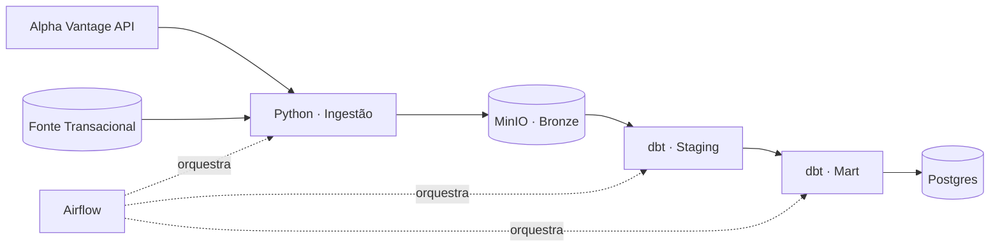

Análise e Desenvolvimento de Sistemas — Fatec Mogi das Cruzes · São Paulo, Brasil

4+ anos atuando em ecossistemas de dados para tomada de decisão financeira e análise de risco — motores de decisão de crédito, validação em produção e shadow mode. Hoje aplico essa vivência para construir pipelines de dados end-to-end e automações com IA generativa aplicadas a problemas reais de negócio.

 

## 🚀 Projeto em destaque

### CâmbioTech — Reconciliação de Ordens FX vs. Mercado *(link a atualizar)*

Pipeline de dados end-to-end que simula o problema de uma corretora de câmbio: reconciliar ordens executadas internamente contra taxas oficiais de mercado para detectar anomalias de precificação e exposição cambial não coberta, dentro de janelas de reporte diário.

- **Ingestão:** dois serviços em Python — consumo de API externa real (Alpha Vantage, com controle de rate limit e quota) e leitura de fonte transacional imperfeita
- **Bronze/Landing zone:** MinIO (S3-compatible), populado via `docker compose up`
- **Transformação:** modelagem em camadas (staging → mart) com dbt, incluindo testes de qualidade de dados
- **Orquestração:** DAG no Airflow cobrindo o fluxo completo de ingestão a mart
- **CI/CD:** GitHub Actions com `dbt seeds` para proteger a quota da API em pipeline de CI
- **Resiliência:** simulação de incidente de produção (breaking change na API) resolvida via branch de hotfix, com plano de rollback documentado

 

### Alertas Inteligentes — LLM + Automação de Observabilidade

Automação que integra Claude (LLM) via Make.com para traduzir alertas técnicos do Datadog em resumos claros e acionáveis no Slack — reduzindo o tempo de triagem de incidentes ao filtrar ruído e destacar o que realmente exige ação da equipe.

 

## 🛠️ Stack

 

## 📊 Atividade

 

## 📬 Contato

