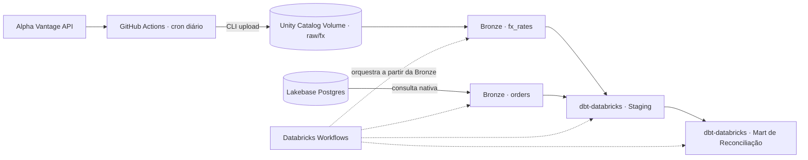

Análise e Desenvolvimento de Sistemas — Fatec Mogi das Cruzes · São Paulo, Brasil

4+ anos atuando em ecossistemas de dados para tomada de decisão financeira e análise de risco — motores de decisão de crédito, validação em produção e shadow mode. Hoje aplico essa vivência para construir pipelines de dados end-to-end e automações com IA generativa aplicadas a problemas reais de negócio.

 

## 🚀 Projeto em destaque

### CâmbioTech — Reconciliação de Ordens FX vs. Mercado *(link a atualizar)*

Pipeline de dados end-to-end que simula o problema de uma corretora de câmbio: reconciliar ordens executadas internamente contra taxas oficiais de mercado para detectar anomalias de precificação e exposição cambial não coberta, dentro de janelas de reporte diário. Construído sobre Databricks (Free Edition), com Lakebase Postgres como fonte transacional gerenciada.

**Status:** 🔄 em andamento
- [ ] Bloco 1 — Ingestão (Alpha Vantage + Lakebase Postgres) até Bronze Delta
- [ ] Bloco 2 — `dbt-databricks` staging → mart via SQL Warehouse, testes verdes
- [ ] Bloco 3 — Databricks Workflows, CI/CD, crise simulada, README final

*Detalhamento completo (schemas, nomes de modelo, lógica do join de reconciliação, ordem das tasks) em [`ARCHITECTURE.md`](#) (link a atualizar).*

- **Ingestão — Alpha Vantage (externa):** GitHub Actions em cron diário protege a quota (25 req/dia), sobe o raw a um Unity Catalog Volume via Databricks CLI — único caminho que precisa sair do workspace
- **Ingestão — Lakebase (nativa):** consultada direto por task do Databricks Workflows, sem upload externo
- **Bronze:** duas tabelas independentes (uma por fonte), captura fiel sem transformação de negócio
- **Transformação:** staging normaliza cada fonte separadamente; o mart faz o join FX × ordens pela janela de tempo/par de moeda e calcula o desvio de precificação, com testes dbt cobrindo limites de desvio e ordens órfãs
- **Orquestração:** Workflows dispara as duas Bronze em paralelo (fontes independentes) → staging → mart
- **CI/CD:** GitHub Actions com lint (`black`, `flake8`, `sqlfluff`), `dbt build` com seeds (protege a quota) e Databricks Asset Bundles para deploy dos Jobs
- **Resiliência:** simulação de incidente de produção (breaking change na API) resolvida via branch de hotfix, com plano de rollback documentado

 

### Alertas Inteligentes — LLM + Automação de Observabilidade

Automação que integra Claude (LLM) via Make.com para traduzir alertas técnicos do Datadog em resumos claros e acionáveis no Slack — reduzindo o tempo de triagem de incidentes ao filtrar ruído e destacar o que realmente exige ação da equipe.

 

## 🛠️ Stack

 

## 📬 Contato

